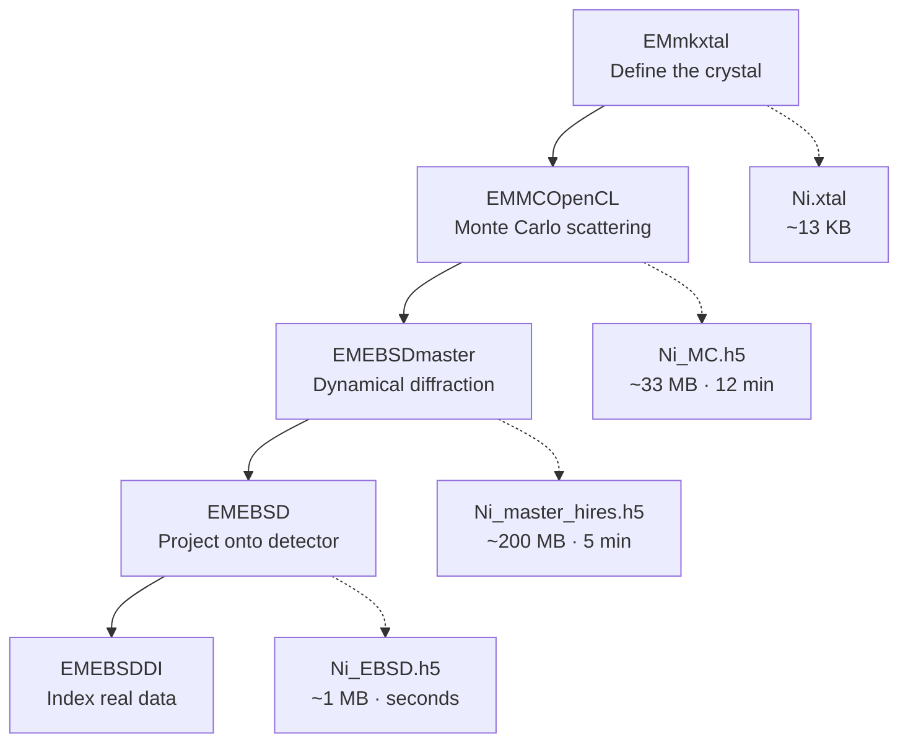

# EMsoft on Windows (via WSL2) — Complete Build & Usage Guide

**A working installation of EMsoft 5.0.X with every workaround documented.**

Tested: August 2026 · Ubuntu on WSL2 · GCC/GFortran 15.2.0 · PoCL 6.0 (CPU OpenCL) · Intel Core Ultra 9 285H

---

## Table of contents

1. [What is this software for?](#1-what-is-this-software-for)
2. [The science, in plain language](#2-the-science-in-plain-language)
3. [The pipeline](#3-the-pipeline)
4. [Before you start](#4-before-you-start)
5. [Known problems and their fixes](#5-known-problems-and-their-fixes)
6. [Part A — Building the software](#6-part-a--building-the-software)
7. [Part B — Running a simulation](#7-part-b--running-a-simulation)
8. [File structure reference](#8-file-structure-reference)
9. [Parameter reference](#9-parameter-reference)
10. [Troubleshooting](#10-troubleshooting)
11. [Glossary](#11-glossary)

---

## 1. What is this software for?

### The everyday version

Metals are not smooth, uniform blocks. Zoom in far enough and a piece of steel or nickel is a mosaic of millions of tiny crystals packed against each other, like a dry-stone wall built from irregular blocks. Inside each block the atoms sit in a perfectly regular repeating grid — but each block is **rotated differently** from its neighbours.

That rotation is not a cosmetic detail. It determines:

- how strong the metal is, and in which direction
- where cracks start and which way they travel
- how the metal corrodes
- whether a sheet can be bent without tearing

So engineers studying a turbine blade, a weld, or a battery electrode want a **map**: at every point on the surface, which way is the crystal pointing?

**EBSD** (Electron Backscatter Diffraction) is the measurement technique that produces that map. **EMsoft** is the software that simulates what EBSD *should* measure, which is what makes the measurement interpretable.

### Why simulation is necessary

An electron microscope hands you an image — a pattern of criss-crossing bands — and asks: *which crystal orientation produced this?*

To answer, you must already know what pattern each possible orientation produces. The modern approach is **dictionary indexing**: simulate patterns for tens of thousands of candidate orientations, then compare your measured pattern against all of them and take the best match. This is far more robust on noisy or deformed samples than older geometric methods — but it only works if the simulated patterns are physically accurate.

EMsoft generates those patterns from first principles.

---

## 2. The science, in plain language

### The experiment

```
       electron beam
            │
            ▼                          ┌─────────────┐
        ╱╲  ·                          │╲  ╱  ╲   ╱  │
       ╱  ╲ · ·  ·  ·  ·  ·  ·  ·  ·  →│ ╲╱    ╲ ╱   │
      ╱    ╲· · · · · · · · · · · · · →│ ╱╲    ╱ ╲   │  detector
     ╱ SAMPLE ╲ · · · · · · · · · ·  →│╱  ╲  ╱   ╲  │  screen
    ╱  tilted   ╲                      └─────────────┘
   ╱   70°       ╲                       Kikuchi bands
  ╱───────────────╲
```

1. An electron beam is fired at a crystalline sample inside a scanning electron microscope.
2. The sample is tilted steeply — **70°**. At normal incidence most electrons bury themselves in the material; at a steep tilt far more escape near the surface. (In our nickel run, 57% of incident electrons came back out.)
3. Electrons penetrate, bounce around, and some scatter back out. On the way out they **diffract** off the regular planes of atoms.
4. Diffraction only happens at specific angles set by the spacing between atomic planes. So electrons leave in **cones**, and where those cones intersect the flat detector you get pairs of parallel lines.

Those line pairs are **Kikuchi bands**. Each band corresponds to one family of atomic planes; the band's width is set by the plane spacing. Where several bands converge, you have a **zone axis** — a crystal direction along which many planes are parallel.

**The key fact:** the *contents* of the pattern depend only on the material. *Where* the bands land on the screen depends entirely on how the crystal is rotated. Rotate the grain, and the whole pattern shifts. That is the measurement.

### Two concepts that confuse everyone

**Master pattern vs. individual pattern.** Think of a globe and a photograph.

- The **master pattern** is a *world map* — the entire sphere of diffracted intensity around the crystal, flattened onto a square. It shows every direction at once. It is a property of the *material* and contains no orientation information. It is expensive to compute (minutes to hours) but you compute it **once per material**.
- An **EBSD pattern** is a *photograph taken from one spot*. It is a small window onto that same sphere, seen from one particular crystal orientation, projected onto one particular camera. It is generated in milliseconds by rotating the sphere and reading off the visible patch.

This is why the workflow is structured the way it is: pay the expensive physics cost once, then generate unlimited patterns cheaply.

**Why the master pattern looks so symmetric.** Because it contains *all* directions, every symmetry the crystal possesses must appear in the image. Nickel has 48 point-symmetry operations, and you can see them directly: four-fold rotation at the centre, mirror lines horizontal, vertical, and diagonal. Individual patterns look messier because a random window onto a symmetric object is generally not itself symmetric.

---

## 3. The pipeline



| Stage | Program | What it computes | Hardware | Our timing |
|---|---|---|---|---|
| 1 | `EMmkxtal` | Unit cell, symmetry expansion | trivial | instant |
| 2 | `EMMCOpenCL` | Where backscattered electrons come from, at what depth and energy | **OpenCL** | 707 s / 100M electrons |
| 3 | `EMEBSDmaster` | Diffracted intensity in every direction, per energy bin | **CPU threads (OpenMP)** | 289 s at full resolution |
| 4 | `EMEBSD` | What a specific camera sees for a specific orientation | CPU | seconds |
| 5 | `EMEBSDDI` | Best-match orientation for measured patterns | **OpenCL** | varies |

**Each stage reads the previous stage's output file.** Stage 2 does *no* diffraction physics — it is pure scattering statistics. Stage 3 does the diffraction. Stage 4 is pure geometry.

---

## 4. Before you start

### Why WSL2 and not Windows

We first attempted a native Windows build. It failed at a wall that **cannot be worked around**:

```
'H5make_libsettings.exe' was blocked by your organization's Device Guard policy.
```

Windows Defender Application Control (WDAC) is enforced by the Windows kernel and blocks execution of unsigned, freshly-compiled binaries. HDF5's build process must *run* a helper executable it just compiled, so the build cannot complete. More importantly, **every EMsoft program you compiled would be blocked too** — so even a successful build would be useless.

WSL2 runs its own Linux kernel and is not governed by the Windows WDAC policy. It is also the far better-trodden path: EMsoft's Linux build with `gfortran` is what the developers actually test.

> **If you are on a managed/corporate/university laptop:** confirm with your IT department that using WSL2 for this is acceptable before proceeding. The policy exists for a reason.

Beyond the policy issue, the native Windows path also fights: spaces in `C:\Users\First Last\` breaking CMake arguments, Visual Studio generator incompatibility (EMsoftSuperbuild only supports NMake), and Intel's `ifx` compiler being unrecognised by EMsoft's compiler checks. See [Appendix: Windows-specific issues](#appendix-windows-specific-issues) if you must go that route.

### Requirements

| | |
|---|---|
| **OS** | Windows 10/11 with WSL2, Ubuntu distro |
| **Disk** | ~15 GB free in the Linux filesystem |
| **RAM** | 8 GB minimum, 16 GB comfortable |
| **CPU** | More cores = faster. Ours: 16 threads |
| **GPU** | **Not required.** See below |
| **Time** | ~1 hour for the build, ~20 min for a full simulation run |

### About the GPU

**You do not need a GPU.** EMsoft's OpenCL code was written for NVIDIA hardware, but it runs fine on **PoCL**, a CPU-based OpenCL implementation, after one small source patch (documented below).

Only stages 2 and 5 use OpenCL at all. Stage 2 processed 100 million electrons in 12 minutes on CPU. A discrete GPU would speed that up perhaps 10–50× and matter for large-scale dictionary indexing, but it is not needed to learn or use the software.

> **Critical:** work inside the Linux filesystem (`~/`), **never** `/mnt/c/...`. Cross-filesystem I/O in WSL is dramatically slower and causes permission problems during builds.

---

## 5. Known problems and their fixes

**This is the most valuable section of this document.** None of these are in the official documentation. Each cost significant debugging time.

| # | Symptom | Root cause | Fix |
|---|---|---|---|
| 1 | `Compatibility with CMake < 3.5 has been removed` — fftw, jsonfortran, CLFortran fail at configure | Modern distros ship CMake 4.x, which made old `cmake_minimum_required` a hard error | Install CMake 3.31.6 in a venv and put it first on PATH |
| 2 | `'uint32_t' does not name a type` in `sht_file.hpp` | GCC 13+ stopped transitively including `<cstdint>`; the header never included it explicitly | Configure with `-DCMAKE_CXX_FLAGS="-include cstdint"` |
| 3 | `Could NOT find BLAS (missing: BLAS_LIBRARIES)` | Linear algebra libraries not installed; on Windows these came from Intel MKL | `sudo apt install libopenblas-dev liblapack-dev` |
| 4 | `CLinit_PDCCQ:clGetDeviceIDs: CL_DEVICE_NOT_FOUND` | EMsoft requests `CL_DEVICE_TYPE_GPU`; PoCL only offers a CPU device | Patch `CLsupport.f90`: `CL_DEVICE_TYPE_GPU` → `CL_DEVICE_TYPE_ALL` |
| 5 | `EBSDcopyMCdata: h5copypath must be set in the name list file` | The "SDK users can leave this undefined" logic doesn't fire | Set the full path to `h5copy` explicitly in the namelist |
| 6 | Backscatter yield wrong at small electron counts | `EMMCOpenCL` processes electrons in batches of 8,192,000; smaller requests normalise incorrectly | Always request **≥ 8,192,000** electrons |
| 7 | `Attempting to set number of threads to 1` despite `nthreads = 0` | The "0 = use maximum" logic doesn't work | Set `nthreads` to your actual core count |
| 8 | `ModuleNotFoundError: No module named 'h5py'` after `apt install` | The CMake venv on PATH shadows the system `python3` | Call `/usr/bin/python3` explicitly, or fix PATH (see below) |
| 9 | `EMOpenCLinfo` crashes with `CL_INVALID_VALUE` | Queries a device property PoCL doesn't expose | **Harmless.** Diagnostic program only. Use `clinfo` instead |

---

## 6. Part A — Building the software

### A1 · Prepare WSL

In **PowerShell**:

```powershell
wsl -l -v          # confirm you have an Ubuntu distro at VERSION 2
wsl -d Ubuntu
```

On first launch you'll create a Linux username and password (separate from Windows). Then, inside Ubuntu:

```bash
lsb_release -a
df -h ~            # need ~15 GB free
```

### A2 · Install the toolchain

```bash
sudo apt update
sudo apt install -y build-essential gfortran git curl python3-pip python3-venv
sudo apt install -y libopenblas-dev liblapack-dev          # FIX #3
sudo apt install -y ocl-icd-opencl-dev opencl-headers pocl-opencl-icd clinfo
```

| Package | Why |
|---|---|
| `build-essential` | GCC, G++, make |
| `gfortran` | Fortran compiler — EMsoft is mostly Fortran |
| `libopenblas-dev`, `liblapack-dev` | Linear algebra. **Build fails without these** |
| `pocl-opencl-icd` | CPU-based OpenCL runtime |
| `clinfo` | Verifies OpenCL works |

Confirm OpenCL is alive:

```bash
clinfo | head -20      # should list "Portable Computing Language" and a CPU device
```

### A3 · Install CMake 3.31 — **FIX #1**

Check what you have:

```bash
cmake --version
```

If it reports **4.x**, you must install an older CMake. EMsoft's dependencies use `cmake_minimum_required(VERSION <3.5)`, which CMake 4 rejects outright.

```bash
python3 -m venv ~/.cmake3
~/.cmake3/bin/pip install "cmake==3.31.6"
mkdir -p ~/bin
ln -sf ~/.cmake3/bin/cmake ~/bin/cmake
ln -sf ~/.cmake3/bin/ctest ~/bin/ctest
echo 'export PATH="$HOME/bin:$PATH"' >> ~/.bashrc
export PATH="$HOME/bin:$PATH"
hash -r
cmake --version        # must show 3.31.6
which python3          # must show /usr/bin/python3
```

> **Why the symlinks instead of adding the venv to PATH?** The venv contains its own `python3`, which would shadow the system Python and break `h5py` later (**FIX #8**). Symlinking only `cmake` and `ctest` avoids that entirely.

### A4 · Build the SDK (third-party dependencies)

```bash
mkdir -p ~/EMsoft_SDK ~/EMsoft-Dev
cd ~/EMsoft-Dev
git clone -b develop https://github.com/EMsoft-org/EMsoftSuperbuild.git
cd EMsoftSuperbuild
mkdir Release && cd Release
cmake -DEMsoft_SDK=$HOME/EMsoft_SDK -DCMAKE_BUILD_TYPE=Release ../
make -j$(nproc) 2>&1 | tee ~/superbuild.log
```

> The `develop` branch is required for EMsoft 5.0.X. (`developOO` is for EMsoftOO / v6.)

This downloads and compiles six libraries. **Expect 20–45 minutes.**

| Library | Purpose |
|---|---|
| `fftw` | Fast Fourier transforms |
| `hdf5` | Scientific data file format |
| `jsonfortran` | JSON parsing from Fortran |
| `CLFortran` | Fortran bindings for OpenCL |
| `bcls` | Bound-constrained least squares |
| `nlopt` | Non-linear optimisation |

Verify all six landed:

```bash
ls ~/EMsoft_SDK
# expect: CLFortran-… bcls-… fftw-… hdf5-… jsonfortran-… nlopt-… EMsoft_SDK.cmake superbuild
```

### A5 · Patch the OpenCL device type — **FIX #4**

Do this **before** building EMsoft, so it compiles in.

```bash
cd ~/EMsoft-Dev
git clone -b develop https://github.com/EMsoft-org/EMsoft.git
git clone -b develop https://github.com/EMsoft-org/EMsoftData.git

cd ~/EMsoft-Dev/EMsoft
cp Source/EMOpenCLLib/CLsupport.f90 Source/EMOpenCLLib/CLsupport.f90.bak
sed -i 's/CL_DEVICE_TYPE_GPU/CL_DEVICE_TYPE_ALL/g' Source/EMOpenCLLib/CLsupport.f90
grep -n "CL_DEVICE_TYPE" Source/EMOpenCLLib/CLsupport.f90
```

Expected: `_ALL` on lines 236, 250, 557, 560, 653, 656; `_CPU` still on 167, 168, 181 (a different code path — leave it).

> **Why:** EMsoft asks OpenCL for a *GPU-type* device. PoCL provides a *CPU-type* device. `CL_DEVICE_TYPE_ALL` accepts either. The EMsoft developers left `CL_DEVICE_TYPE_ALL` commented out directly above line 236, so this is a known toggle.

`EMsoftData` must be cloned as a **sibling** of `EMsoft` — it holds namelist templates and reference data.

### A6 · Build EMsoft — **FIX #2**

```bash
cd ~/EMsoft-Dev
mkdir EMsoftBuild && cd EMsoftBuild
mkdir Release && cd Release
cmake -DCMAKE_BUILD_TYPE=Release \
      -DEMsoft_SDK=$HOME/EMsoft_SDK \
      -DCMAKE_CXX_FLAGS="-include cstdint" \
      ../../EMsoft
make -j$(nproc) 2>&1 | tee ~/emsoft-build.log
```

> **`-include cstdint`** force-includes that header into every C++ file. Without it, `sht_file.hpp` fails with dozens of `'uint32_t' does not name a type` errors, because GCC 13+ no longer pulls it in transitively.

Warnings about *"Fortran 2018 deleted feature: Arithmetic IF statement"* are cosmetic — that's 1970s-era numerical code compiling under a modern standard.

Verify:

```bash
ls ~/EMsoft-Dev/EMsoftBuild/Release/Bin | wc -l   # expect ~131
echo 'export PATH=$PATH:$HOME/EMsoft-Dev/EMsoftBuild/Release/Bin' >> ~/.bashrc
export PATH=$PATH:$HOME/EMsoft-Dev/EMsoftBuild/Release/Bin
```

### A7 · Configure EMsoft

```bash
mkdir -p ~/EMsoftData_work/XtalFolder
EMsoftinit          # note the lowercase 'i'
```

It asks for name, email, and affiliation, then writes a skeleton config with placeholder paths. **Overwrite it properly:**

```bash
cat > ~/.config/EMsoft/EMsoftConfig.json << 'EOF'
{
        "EMsoftpathname": "/home/YOURNAME/EMsoft-Dev/EMsoft/",
        "EMXtalFolderpathname": "/home/YOURNAME/EMsoftData_work/XtalFolder/",
        "EMdatapathname": "/home/YOURNAME/EMsoftData_work/",
        "EMtmppathname": "/home/YOURNAME/.config/EMsoft/tmp/",
        "EMsoftLibraryLocation": "/home/YOURNAME/EMsoft-Dev/EMsoftBuild/Release/Bin/",
        "EMNotify": "Off",
        "Release": "Yes",
        "Develop": "No",
        "UserName": "your name",
        "UserEmail": "your@email",
        "UserLocation": "your institution"
}
EOF
```

Replace `YOURNAME` throughout (`echo $HOME` gives it to you).

**Rules that bite people:**
- Every path **must end with `/`**
- `EMdatapathname` must **not** be inside `EMsoftpathname`
- Exactly one of `Release` / `Develop` must be `Yes`

Verify:

```bash
EMsoftConfigTest
```

Every path should resolve, and `h5copypath` should point into your SDK. **Copy that `h5copypath` value — you need it for FIX #5.**

---

## 7. Part B — Running a simulation

Worked example: **nickel** (FCC, a = 0.3524 nm, space group 225).

### B1 · Create the crystal file

```bash
cd ~/EMsoftData_work
EMmkxtal
```

| Prompt | Answer | Meaning |
|---|---|---|
| crystal system | `1` | Cubic |
| a [nm] | `0.3524` | Unit cell edge length |
| space group number | `225` | Fm-3m — the symmetry code for FCC |
| Atomic number | `28` | Nickel |
| Coordinates, occupation, DW factor | `0.0,0.0,0.0,1.0,0.0035` | **All five on one line, comma-separated** |
| Another atom? | `n` | |
| File name | `Ni.xtal` | |
| Source for this data | any text | Provenance note, e.g. `Test structure, standard FCC Ni` |

> **Common crash:** entering only the three coordinates on the "Fractional coordinates, site occupation, and Debye-Waller Factor" line causes `Fortran runtime error: End of file`. It wants **five** numbers.

Verify:

```bash
EMshowxtal      # enter Ni.xtal
```

Correct output shows 4 atoms per unit cell, space group symbol `F m 3 m`, 192 symmetry matrices, 48 point-group matrices. **You entered one atom; symmetry generated the other three.**

### B2 · Monte Carlo simulation — **FIX #6**

```bash
cd ~/EMsoftData_work
EMMCOpenCL -t
cp EMMCOpenCL.template MCNi.nml

sed -i "s/ totnum_el = 2000000000,/ totnum_el = 100000000,/" MCNi.nml
sed -i "s/ EkeV = 30.D0,/ EkeV = 20.D0,/"                    MCNi.nml
sed -i "s/ Ehistmin = 15.D0,/ Ehistmin = 10.D0,/"            MCNi.nml
sed -i "s/ globalworkgrpsz = 150,/ globalworkgrpsz = 128,/"  MCNi.nml
sed -i "s/ Notify = 'on',/ Notify = 'off',/"                 MCNi.nml
sed -i "s/ dataname = 'Ni_MC.h5'/ dataname = 'Ni_MC.h5'/"    MCNi.nml

grep -E "xtalname|totnum_el|EkeV|Ehistmin|platid|devid|dataname" MCNi.nml
EMMCOpenCL MCNi.nml
```

Also confirm `xtalname = 'Ni.xtal'`, `mode = 'full'`, `sig = 70.0`, `platid = 1`, `devid = 1`.

> **Never request fewer than 8,192,000 electrons.** That is the internal batch size; smaller runs report an incorrect backscatter yield. A 1,000,000-electron test gave 0.652; the correct value at 100M is 0.569.

**Expected:** ~12 minutes, yield ≈ 0.57 for Ni at 20 kV / 70° tilt, output `Ni_MC.h5` (~33 MB).

*What this computed:* for every electron that escaped — how deep it went, how much energy it lost, which direction it left in. Pure scattering statistics; no diffraction yet.

### B3 · Master pattern — **FIX #5 and #7**

```bash
cd ~/EMsoftData_work
EMEBSDmaster -t
cp EMEBSDmaster.template EMEBSDmaster.nml
cp BetheParameters.template BetheParameters.nml

sed -i "s/ npx = 500,/ npx = 500,/"                                    EMEBSDmaster.nml
sed -i "s/ dmin = 0.05,/ dmin = 0.03,/"                                EMEBSDmaster.nml
sed -i "s/ nthreads = 1,/ nthreads = 16,/"                             EMEBSDmaster.nml
sed -i "s/ energyfile = 'MCoutput.h5',/ energyfile = 'Ni_master.h5',/" EMEBSDmaster.nml
sed -i "s/ copyfromenergyfile = 'undefined',/ copyfromenergyfile = 'Ni_MC.h5',/" EMEBSDmaster.nml
sed -i "s|^ h5copypath = 'undefined',| h5copypath = '$HOME/EMsoft_SDK/hdf5-1.12.2-Release/bin/h5copy',|" EMEBSDmaster.nml

EMEBSDmaster EMEBSDmaster.nml
```

> **FIX #5:** `h5copypath` must be set explicitly even though the template says SDK users can skip it. Get the exact path from `EMsoftConfigTest` output.
>
> **FIX #7:** `nthreads = 0` does *not* mean "use all cores" — it silently runs single-threaded. Set your real core count (`nproc`).
>
> **On `copyfromenergyfile`:** this duplicates the Monte Carlo data into a new file, leaving `Ni_MC.h5` untouched so you can run different master settings without redoing the 12-minute MC.

**Timing on 16 threads:**

| `npx` | `dmin` | Beam directions | Time |
|---|---|---|---|
| 100 | 0.05 | 5,152 | 30 s (single-threaded!) |
| 500 | 0.03 | 125,752 | 289 s |

Start with `npx = 100` to verify the pipeline, then re-run at 500.

*What this computed:* the diffracted intensity in **every direction**, for each of 11 energy bins, by solving the dynamical diffraction equations. This is the expensive step and the reusable one.

### B4 · View the master pattern — **FIX #8**

```bash
sudo apt install -y python3-h5py python3-matplotlib
cd ~/EMsoftData_work

cat > view_master.py << 'EOF'
import h5py, numpy as np, matplotlib
matplotlib.use('Agg')
import matplotlib.pyplot as plt

f = h5py.File('Ni_master_hires.h5', 'r')
d = f['EMData/EBSDmaster/mLPNH'][:]
print('dataset shape:', d.shape)
img = np.squeeze(d)
while img.ndim > 2:
    img = img.sum(axis=0)
plt.figure(figsize=(7, 7))
plt.imshow(img, cmap='gray')
plt.axis('off')
plt.tight_layout()
plt.savefig('Ni_master.png', dpi=150, bbox_inches='tight')
print('wrote Ni_master.png')
EOF

/usr/bin/python3 view_master.py
explorer.exe .
```

> **Use `/usr/bin/python3`, not `python3`** — unless you followed the symlink approach in A3, the CMake venv shadows the system Python and `h5py` will not be found.

`explorer.exe .` opens the current folder in Windows Explorer so you can double-click the PNG.

**What you should see:** a square criss-crossed with bands, with obvious four-fold symmetry at the centre and mirror symmetry across the horizontal, vertical, and diagonal axes. That symmetry is the crystal's 48 point-group operations made visible — it was not drawn or assumed, it fell out of the physics.

Bright nodes where many bands converge are **zone axes**. The centre is `[001]`.

### B5 · Simulate detector patterns

```bash
cd ~/EMsoftData_work
EMEBSD -t
cp EMEBSD.template EMEBSD.nml

cat > angles.txt << 'EOF'
eu
3
0.0 0.0 0.0
30.0 45.0 10.0
0.0 54.7 45.0
EOF

sed -i "s/ numsx = 0,/ numsx = 640,/"                                EMEBSD.nml
sed -i "s/ numsy = 0,/ numsy = 480,/"                                EMEBSD.nml
sed -i "s/ energymin = 5.0,/ energymin = 10.0,/"                     EMEBSD.nml
sed -i "s/ anglefile = 'testeuler.txt',/ anglefile = 'angles.txt',/" EMEBSD.nml
sed -i "s/ masterfile = 'master.h5',/ masterfile = 'Ni_master_hires.h5',/" EMEBSD.nml
sed -i "s/ datafile = 'EBSDout.h5',/ datafile = 'Ni_EBSD.h5',/"      EMEBSD.nml
sed -i "s/ scalingmode = 'not',/ scalingmode = 'gam',/"              EMEBSD.nml
sed -i "s/ gammavalue = 1.0,/ gammavalue = 0.34,/"                   EMEBSD.nml
sed -i "s/ nthreads = 1,/ nthreads = 16,/"                           EMEBSD.nml

EMEBSD EMEBSD.nml
```

> **`numsx`/`numsy` default to 0** and must be set — that's your camera resolution.
>
> **`energymin` must be ≥ your Monte Carlo's `Ehistmin`.** The default 5.0 asks for data that doesn't exist if your MC started at 10 keV.

The angle file format is: `eu` (Euler angles), then a count, then one orientation per line as Bunge Euler angles φ1, Φ, φ2 in degrees.

### B6 · View the patterns

```bash
cd ~/EMsoftData_work
cat > view_patterns.py << 'EOF'
import h5py, numpy as np, matplotlib
matplotlib.use('Agg')
import matplotlib.pyplot as plt

f = h5py.File('Ni_EBSD.h5', 'r')
def find(name, obj):
    if isinstance(obj, h5py.Dataset) and obj.ndim >= 3:
        print(name, obj.shape, obj.dtype)
f.visititems(find)

d = f['EMData/EBSD/EBSDPatterns'][:]
labels = ['(0, 0, 0)', '(30, 45, 10)', '(0, 54.7, 45)']
fig, ax = plt.subplots(1, 3, figsize=(15, 4))
for i in range(3):
    ax[i].imshow(d[i], cmap='gray')
    ax[i].set_title(labels[i])
    ax[i].axis('off')
plt.tight_layout()
plt.savefig('Ni_patterns.png', dpi=150, bbox_inches='tight')
print('wrote Ni_patterns.png')
EOF

/usr/bin/python3 view_patterns.py
explorer.exe .
```

The script prints every 3-D dataset first, so if the path is wrong you'll see the correct one.

**What you should see:** three distinct Kikuchi patterns with sharp bands, bright zone-axis nodes, and a smooth background gradient. Bands are near-straight at the centre and curve toward the edges — that's the gnomonic projection of a flat detector intercepting diffraction cones, exactly as a real camera records.

**All three came from the single master pattern.** No new physics was computed — just rotation and sampling.

### Where to go next

- **Different material:** repeat B1–B3 with new crystal parameters. Everything downstream is identical.
- **Build a dictionary:** use `EMsampleRFZ` to generate orientations covering the fundamental zone, then run `EMEBSD` with `makedictionary = 'y'`.
- **Index real data:** `EMEBSDDI` matches experimental patterns against that dictionary. This is the actual research application — and the most OpenCL-heavy, so expect it to be slow on CPU.

---

## 8. File structure reference

### Directory layout

```
~/
├── .cmake3/                       CMake 3.31.6 venv (FIX #1)
├── bin/                           symlinks: cmake, ctest
├── .config/EMsoft/
│   ├── EMsoftConfig.json          global config — all paths live here
│   └── tmp/                       scratch space
├── EMsoft_SDK/                    third-party libraries (~2 GB)
│   ├── EMsoft_SDK.cmake           tells EMsoft's CMake where everything is
│   ├── fftw-3.3.8/
│   ├── hdf5-1.12.2-Release/       includes bin/h5copy — needed for FIX #5
│   ├── jsonfortran-4.3.0-Release/
│   ├── CLFortran-0.0.1-Release/
│   ├── bcls-0.1-Release/
│   ├── nlopt-2.10.0-Release/
│   └── superbuild/                build artefacts + logs
├── EMsoft-Dev/
│   ├── EMsoftSuperbuild/          builds the SDK
│   ├── EMsoft/                    source code (patched CLsupport.f90 here)
│   ├── EMsoftData/                templates and reference data
│   └── EMsoftBuild/Release/
│       └── Bin/                   ~131 executables — add to PATH
└── EMsoftData_work/               your working directory
    ├── XtalFolder/
    │   └── Ni.xtal
    ├── *.template                 generated by `PROGRAM -t`
    ├── *.nml                      your edited configs
    ├── *.h5                       data files
    ├── angles.txt
    └── view_*.py
```

### What each working file is

| File | Size | Created by | Contents |
|---|---|---|---|
| `XtalFolder/Ni.xtal` | 13 KB | `EMmkxtal` | HDF5. Lattice parameters, space group, atom positions, provenance |
| `MCNi.nml` | 3 KB | you | Monte Carlo settings |
| `Ni_MC.h5` | 33 MB | `EMMCOpenCL` | Depth/energy/direction histograms for 57M backscattered electrons |
| `EMEBSDmaster.nml` | 2 KB | you | Master pattern settings |
| `BetheParameters.nml` | 1 KB | `EMEBSDmaster -t` | Thresholds for classifying reflections strong/weak/negligible |
| `Ni_master.h5` | 40 MB | `EMEBSDmaster` | Draft master pattern (`npx=100`) + copied MC data |
| `Ni_master_hires.h5` | 200 MB | `EMEBSDmaster` | Full master pattern (`npx=500`, `dmin=0.03`) |
| `angles.txt` | 1 KB | you | Orientations to simulate |
| `EMEBSD.nml` | 4 KB | you | Detector geometry and output settings |
| `Ni_EBSD.h5` | 943 KB | `EMEBSD` | Three 640×480 simulated patterns |
| `view_master.py` | 1 KB | you | Extracts master pattern to PNG |
| `view_patterns.py` | 1 KB | you | Extracts detector patterns to PNG |

### Inside the HDF5 files

All EMsoft `.h5` files share a structure — inspect with `h5ls -r file.h5`:

| Group | Contains |
|---|---|
| `/CrystalData` | The crystal structure, carried forward from `Ni.xtal` |
| `/EMData/MCOpenCL` | Monte Carlo results: `accum_e`, `accum_z` |
| `/EMData/EBSDmaster` | Master pattern arrays: `mLPNH` (northern hemisphere), `mLPSH` (southern) |
| `/EMData/EBSD` | `EBSDPatterns` — the simulated detector images |
| `/EMheader/...` | Program name, version, timestamp, hostname |
| `/NMLfiles/...` | **A verbatim copy of the namelist used.** Full reproducibility |
| `/NMLparameters/...` | The same settings as structured data |

> Every output file embeds the exact settings that produced it. Months later you can recover precisely how any result was generated.

### The `.template` / `.nml` convention

Every EMsoft program generates a documented template:

```bash
PROGRAMNAME -t          # writes PROGRAMNAME.template
```

Copy it to a `.nml`, edit, and run `PROGRAMNAME yourfile.nml`. Templates carry inline comments explaining each parameter — read them; they are the real documentation.

---

## 9. Parameter reference

### `EMMCOpenCL` — Monte Carlo

| Parameter | Our value | Meaning |
|---|---|---|
| `mode` | `'full'` | `'full'` = EBSD, `'bse1'` = ECP, `'Ivol'` = interaction volume |
| `xtalname` | `'Ni.xtal'` | Crystal file in `XtalFolder` |
| `sig` | `70.0` | Sample tilt from horizontal, degrees. Standard EBSD value |
| `omega` | `0.0` | Sample tilt about RD axis |
| `EkeV` | `20.D0` | Accelerating voltage, kV. 20 is typical |
| `Ehistmin` | `10.D0` | Lowest energy to record. Must be < `EkeV` |
| `Ebinsize` | `1.0D0` | Energy bin width. (20−10)/1 = 11 bins |
| `depthmax` | `100.D0` | Max exit depth to track, nm |
| `totnum_el` | `100000000` | **Must be ≥ 8,192,000** (FIX #6) |
| `platid` / `devid` | `1` / `1` | OpenCL platform and device index |
| `globalworkgrpsz` | `128` | Work-group size. Powers of two suit CPU |
| `numsx` | `501` | Square projection resolution |

### `EMEBSDmaster` — master pattern

| Parameter | Our value | Meaning |
|---|---|---|
| `dmin` | `0.03` | Smallest atomic-plane spacing in nm to include. **Lower = sharper detail, much slower** |
| `npx` | `500` | Half-width; pattern is (2·npx+1)² per hemisphere |
| `nthreads` | `16` | **Set explicitly** (FIX #7) |
| `energyfile` | `'Ni_master_hires.h5'` | Output file |
| `copyfromenergyfile` | `'Ni_MC.h5'` | Source of MC data |
| `h5copypath` | full path | **Required** (FIX #5) |
| `doLegendre` | `.FALSE.` | `.TRUE.` only for spherical indexing |

Cost scales as roughly `npx²`, and steeply as `dmin` decreases.

### `EMEBSD` — detector simulation

| Parameter | Our value | Meaning |
|---|---|---|
| `L` | `15000.0` | Impact point to screen distance, µm |
| `thetac` | `10.0` | Detector tilt below horizontal, degrees |
| `delta` | `50.0` | Detector pixel size, µm |
| `numsx` / `numsy` | `640` / `480` | Camera resolution. **Defaults to 0 — must set** |
| `xpc` / `ypc` | `0.0` / `0.0` | Pattern centre offset in pixels; 0,0 = dead centre |
| `energymin` / `energymax` | `10.0` / `20.0` | **`energymin` must be ≥ MC's `Ehistmin`** |
| `includebackground` | `'y'` | Adds realistic smooth background |
| `scalingmode` | `'gam'` | Gamma correction — raw patterns are very low contrast |
| `gammavalue` | `0.34` | Lower = more contrast enhancement |
| `anglefile` | `'angles.txt'` | Orientation list |
| `eulerconvention` | `'tsl'` | `'tsl'` or `'hkl'` — must match your data source |
| `binning` | `1` | Pixel binning, 1/2/4/8 |
| `poisson` | `'n'` | Add shot noise — useful for realistic test data |
| `makedictionary` | `'n'` | `'y'` pre-processes patterns for `EMEBSDDI` |

**Pattern centre** is where the beam impact point projects onto the screen. On a real system it must be calibrated; getting it wrong is the most common source of indexing errors.

---

## 10. Troubleshooting

### General method

EMsoft's top-level output is usually **not** the real error. `make` and `nmake` cascade failures upward. Always find the first actual error:

```bash
grep -n -m5 -i "error" ~/emsoft-build.log
```

For superbuild sub-projects, the real log lives in the stamp directory:

```bash
cat ~/EMsoft_SDK/superbuild/<project>/Stamp/<config>/<project>-<step>-err.log
```

And when a parallel build fails confusingly, re-run serially — `make -j` interleaves output from six projects at once:

```bash
make            # no -j
```

### Specific failures

**`Could NOT find BLAS`** → install `libopenblas-dev liblapack-dev`, then **delete and recreate** the build directory. CMake caches failed `find_package` results.

```bash
cd ~/EMsoft-Dev/EMsoftBuild && rm -rf Release && mkdir Release && cd Release
cmake -DCMAKE_BUILD_TYPE=Release -DEMsoft_SDK=$HOME/EMsoft_SDK -DCMAKE_CXX_FLAGS="-include cstdint" ../../EMsoft
```

**`Compatibility with CMake < 3.5`** → see A3. After installing CMake 3.31, wipe both `~/EMsoft_SDK` and the superbuild `Release/` directory; the old cache has `/usr/bin/cmake` baked in.

**`clGetDeviceIDs: CL_DEVICE_NOT_FOUND`** → apply FIX #4 and rebuild. Only OpenCL-linked targets recompile, so it's quick.

**`EMOpenCLinfo` crashes** → ignore it. Use `clinfo` to inspect OpenCL. Compute works fine.

**Backscatter yield looks wrong** → check `totnum_el ≥ 8,192,000`.

**`ModuleNotFoundError: h5py`** → run `which python3`. If it isn't `/usr/bin/python3`, either call the full path or fix your PATH per A3.

**Dataset path errors in the Python scripts** → dataset names vary slightly between EMsoft versions:

```bash
~/EMsoft_SDK/hdf5-1.12.2-Release/bin/h5ls -r yourfile.h5 | grep -i -E "mLPNH|Patterns"
```

**Fortran type-mismatch errors during build** (not seen in our build, but possible on other GCC versions):

```bash
cmake -DCMAKE_CXX_FLAGS="-include cstdint" \
      -DCMAKE_Fortran_FLAGS="-fallow-argument-mismatch -fallow-invalid-boz -std=legacy" \
      ../../EMsoft
```

---

## 11. Glossary

| Term | Meaning |
|---|---|
| **Grain** | One small crystal within a polycrystalline material. Neighbours share atomic structure but differ in rotation |
| **Unit cell** | The smallest repeating box of atoms that tiles to build the whole crystal |
| **Lattice parameter** | Edge length of the unit cell. Nickel: 0.3524 nm |
| **Space group** | Numeric code (1–230) for a crystal's full symmetry. 225 = Fm-3m = FCC |
| **FCC** | Face-centred cubic: atoms at cube corners and face centres. 4 atoms per cell |
| **Debye-Waller factor** | Accounts for thermal vibration of atoms, which slightly blurs diffraction |
| **EBSD** | Electron Backscatter Diffraction — the measurement technique |
| **Kikuchi band** | A pair of parallel lines in the pattern, produced by one family of atomic planes |
| **Zone axis** | A crystal direction along which many planes are parallel; appears as a bright node where bands converge |
| **Backscatter yield** | Fraction of incident electrons that escape back out. 0.57 for Ni at 70° tilt |
| **Monte Carlo** | Simulation by random sampling. Named after the casino |
| **Dynamical diffraction** | Diffraction accounting for multiple scattering and wave interference — as opposed to single-scattering (kinematic) theory |
| **Bethe approximation** | Speed-up that classifies weakly-diffracting beams as "weak" and handles them approximately |
| **Master pattern** | Diffracted intensity in every direction; a material property, orientation-independent |
| **Lambert projection** | Equal-area mapping from sphere to square. Used for the master pattern |
| **Gnomonic projection** | The projection a flat detector naturally produces. Straight near the centre, curving at the edges |
| **Euler angles (Bunge)** | Three rotations (φ1, Φ, φ2) specifying a crystal's orientation |
| **Fundamental zone** | The minimal set of orientations needed given a crystal's symmetry |
| **Dictionary indexing** | Determining orientation by matching a measured pattern against a library of simulated ones |
| **Namelist (.nml)** | Fortran's native config file format |
| **HDF5 (.h5)** | Hierarchical scientific data format for large arrays |
| **OpenCL** | Framework for running compute code on GPUs or CPUs |
| **PoCL** | Portable Computing Language — a CPU implementation of OpenCL |
| **OpenMP** | Framework for multi-threading across CPU cores |
| **WDAC / Device Guard** | Windows policy restricting which executables may run |

---

## Appendix: Windows-specific issues

Recorded in case a native Windows build is unavoidable. **We do not recommend this path.**

| Problem | Detail | Fix |
|---|---|---|
| Spaces in username | `C:\Users\First Last\` splits CMake arguments; `-DEMsoft_SDK=C:\Users\First Last\...` silently becomes `C:\Users\First` | Quote the *whole* argument: `-DEMsoft_SDK="C:/Users/First Last/EMsoft_SDK"`. Better: use `C:\EMsoft_SDK` |
| Wrong generator | CMake defaults to Visual Studio; EMsoftSuperbuild only supports NMake | `cmake -G "NMake Makefiles" ...` |
| `ifx` not recognised | Intel's LLVM Fortran compiler identifies as `IntelLLVM`; EMsoft tests `STREQUAL "Intel"` | Replace `STREQUAL "Intel"` with `MATCHES "^Intel"` throughout `*.cmake` and `CMakeLists.txt` |
| Device Guard blocks execution | Build compiles helper binaries then runs them; WDAC refuses | **No workaround.** Requires an IT policy exception, or move to WSL2 |
| `ls` not recognised | `cmd.exe` doesn't have Unix commands | Use `dir`, or PowerShell |

PowerShell one-liner for the compiler-ID patch:

```powershell
cd "C:\EMsoft-Dev\EMsoftSuperbuild"
Get-ChildItem -Recurse -Include *.cmake,CMakeLists.txt |
  ForEach-Object {
    Copy-Item $_.FullName "$($_.FullName).bak" -Force
    (Get-Content $_.FullName -Raw) -replace
      'CMAKE_Fortran_COMPILER_ID\s+STREQUAL\s+"Intel"',
      'CMAKE_Fortran_COMPILER_ID MATCHES "^Intel"' |
      Set-Content $_.FullName -NoNewline
  }
```

---

## References

- EMsoft: https://github.com/EMsoft-org/EMsoft
- EMsoftSuperbuild: https://github.com/EMsoft-org/EMsoftSuperbuild
- EMsoft wiki: https://github.com/EMsoft-org/EMsoft/wiki
- EMsoftOO (v6, actively maintained, documented `ifx` support): https://github.com/EMsoft-org/EMsoftOO

> **Note on versions:** EMsoft 5.0.X's documented support matrix is Visual Studio 2015 with Intel Fortran v17/v19, or Ubuntu 16.x / CentOS 7.x with GCC 7.x. Building on a 2026 toolchain requires the patches above. If your work does not specifically require the 5.x programs, **EMsoftOO** is the actively maintained line and may need fewer workarounds.

---

*Document produced from a build session on 9 August 2026. Timings measured on an Intel Core Ultra 9 285H (16 threads) under WSL2.*
